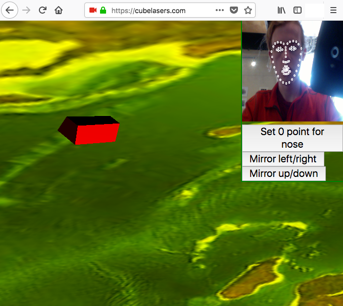

# [Cube Lasers Future Chat](https://cubelasers.com/)

### The online floating cube chatroom

#### You steer with your face!

+ Open the webpage and wait a long time for everything to load.
+ Pick a username and give webcam permissions.  
  (The webcam stream is not sent to our server; it is just used in the browser.)
+ Once it recognizes your face (white dots all over), you can steer around by moving the tip of your nose. You can set the zero point (where you don't turn) or mirror the left/right up/down turning by clicking the buttons.
+ You can shoot a 'laser' (long yellow cylinder) by opening your mouth.
+ Float around and chat with the other players! ('Chat' means shoot lasers. Also, other players cannot see the lasers you shoot.)

[Max Williams](https://github.com/robertmaxwilliams/) and I (Luke) built this in 24 hours at the 2018 RevolutionUC hackathon. We used as many frameworks and things as possible:

+ To render everything, the browser runs [three.js](https://threejs.org/)
  on top of [WebGL](https://www.khronos.org/webgl/)
  in an HTML5 [canvas](https://developer.mozilla.org/en-US/docs/Web/API/Canvas_API).
+ Face tracking is done with the free trial of [Tastenkunst](https://github.com/Tastenkunst)'s
  [Beyond Reality Face SDK](https://github.com/Tastenkunst/brfv4_javascript_examples).
  Their compiled code is the reason for the 8MB repository size.
+ The server is an Amazon Lightsail instance, and it is using Go to handle https
  and usernames and user positions.
